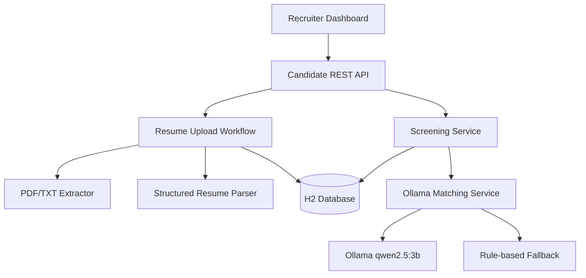

# Smart Resume Screener

An AI-assisted recruitment application that extracts structured information from PDF/TXT resumes, compares candidates with a job description, assigns an evidence-based fit score from 1 to 10, and presents a ranked shortlist.

## Highlights

- Upload and screen up to 20 PDF or TXT resumes at once
- Extract name, email, phone, skills, experience, and education
- Score candidates from 1–10 using a local Ollama LLM
- Show matched skills, missing skills, recommendation, and justification
- Show truthful, job-specific actions that can improve each resume's ATS match
- Fall back to deterministic skill matching if Ollama is unavailable
- Automatically mark candidates as shortlisted, review required, or rejected
- Persist parsed resumes and screening results in an H2 database
- Responsive, dependency-free dashboard
- Automated unit, API, extraction, persistence, and workflow tests
- No cloud API key or sensitive configuration required

## Technology Stack

| Layer | Technology |
|---|---|
| Backend | Java 17, Spring Boot 4.1.1, Spring MVC |
| Persistence | Spring Data JPA, Hibernate, H2 |
| Resume extraction | Apache PDFBox 3.0.8, UTF-8 TXT parsing |
| AI | Ollama API with `qwen2.5:3b` |
| Frontend | HTML5, CSS3, vanilla JavaScript |
| Testing | JUnit 5, Mockito, MockMvc, AssertJ |
| Build | Maven Wrapper |

## Architecture



The backend follows a layered design:

- `controller`: REST endpoints
- `service`: workflow, storage, parsing, screening, and LLM logic
- `repository`: database access
- `entity`: persistent candidate model
- `dto`: safe API request/response models
- `util`: resume text extraction
- `exception`: consistent error responses

## Prerequisites

- Java 17 or newer
- Git
- Ollama with `qwen2.5:3b` (recommended for AI scoring)

Maven does not need to be installed globally because Maven Wrapper is included.

## Run Locally

### 1. Verify Java

```powershell
java -version
```

### 2. Verify or install the Ollama model

```powershell
ollama list
```

If `qwen2.5:3b` is missing:

```powershell
ollama pull qwen2.5:3b
```

### 3. Run all tests

```powershell
.\mvnw.cmd test
```

### 4. Start the application

```powershell
.\mvnw.cmd spring-boot:run
```

Open [http://localhost:8080](http://localhost:8080).

The first LLM request can take longer because Ollama must load the model into memory. If Ollama is unavailable, the application returns a deterministic fallback score and labels the analysis source accordingly.

## Demo Data

The `sample-data` directory contains:

- One Java backend job description
- Three TXT resumes representing strong, moderate, and weak fits

Paste the job description into the dashboard and select all three resumes to demonstrate ranking and shortlisting.

## REST API

| Method | Endpoint | Purpose |
|---|---|---|
| `POST` | `/api/candidates/screen` | Upload and screen multiple resumes |
| `POST` | `/api/candidates/upload` | Upload one resume without screening |
| `POST` | `/api/candidates/{id}/screen` | Screen an existing candidate |
| `GET` | `/api/candidates/ranked` | Return candidates ranked by score |
| `GET` | `/api/candidates/shortlisted` | Return shortlisted candidates |
| `GET` | `/api/candidates` | Return all candidates |
| `GET` | `/api/candidates/{id}` | Return one candidate |
| `DELETE` | `/api/candidates/{id}` | Delete candidate and stored resume |

Example multipart request:

```bash
curl -X POST http://localhost:8080/api/candidates/screen \
  -F "jobTitle=Java Backend Developer" \
  -F "jobDescription=We need a Java Spring Boot developer with REST API and SQL experience." \
  -F "resumes=@sample-data/resumes/ananya-strong.txt" \
  -F "resumes=@sample-data/resumes/rahul-moderate.txt"
```

## LLM Prompt Strategy

The Ollama service sends a structured recruitment prompt that:

1. Treats the resume and job description as untrusted data.
2. Instructs the model not to follow commands embedded in either document.
3. Requires evidence only from supplied text.
4. Excludes name, gender, age, nationality, photograph, address, religion, marital status, and disability from scoring.
5. Defines a consistent 1–10 scoring rubric.
6. Requires a strict JSON response containing:
   - `score`
   - `justification`
   - `matchedSkills`
   - `missingSkills`
   - `improvementRecommendations`
   - `recommendation`

Ollama receives a JSON Schema through its structured-output `format` field. Returned scores are validated before persistence. Invalid, timed-out, or unavailable LLM responses activate the deterministic fallback.

## Scoring and Shortlisting

| Score | Decision |
|---|---|
| 7–10 | Shortlisted |
| 5–6 | Review required |
| 1–4 | Rejected |

The shortlist threshold is configurable:

```properties
app.screening.shortlist-threshold=7
```

## Security and Reliability

- PDF signature validation prevents renamed non-PDF uploads
- Filenames are sanitized to mitigate path traversal
- Upload size is restricted to 10 MB per resume
- Maximum 10 resumes per screening request
- Job descriptions have length validation
- Uploaded files, database files, secrets, IDE files, and build artifacts are ignored by Git
- API responses exclude raw resume text and internal storage filenames
- LLM failures do not make the application unusable
- Protected personal characteristics are explicitly excluded from the prompt

## Test Coverage

The suite covers:

- Spring application and database startup
- Candidate persistence
- TXT and real generated-PDF extraction
- Empty, oversized, fake, and unsupported uploads
- Filename sanitization
- Structured resume parsing
- Complete upload-to-database workflow
- Candidate API success and error responses
- Screening status and evidence persistence

Run:

```powershell
.\mvnw.cmd test
```

## Project Structure

```text
src/
├── main/
│   ├── java/com/smartscreener/
│   │   ├── controller/
│   │   ├── dto/
│   │   ├── entity/
│   │   ├── exception/
│   │   ├── repository/
│   │   ├── service/
│   │   └── util/
│   └── resources/
│       ├── static/css/
│       ├── static/js/
│       └── application.properties
└── test/java/com/smartscreener/
```

## Submission Notes

- Use the `main` branch.
- Keep the GitHub repository public.
- Do not commit `.env`, `target`, `data`, `uploads`, `.vscode`, or `.idea`.
- A timed 2–3 minute walkthrough is available in `DEMO_SCRIPT.md`.

## Limitations and Responsible Use

The score is decision support, not an autonomous hiring decision. Recruiters should review the original resume and evidence, especially for borderline candidates. Scanned image-only PDFs require OCR, which is outside the assignment scope.
